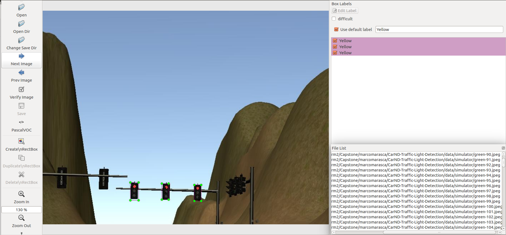
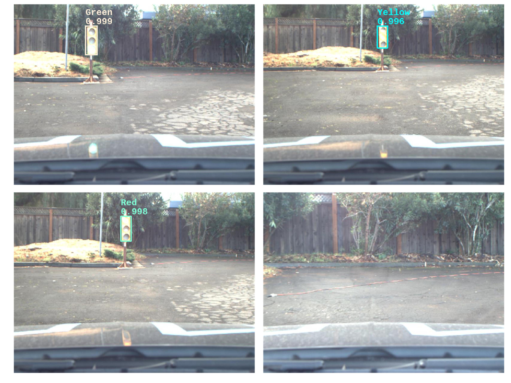

# Self Driving Car - Capstone Project

# Overview

## Team Members

By order of joining the team:
- Ali Kureishy (Lead)
- Eugene Verichev
- Szilard Bessenyei
- Naveed Usmani
- Mark Melnykowycz

# Architecture

This project aims to integrate different components of autonomous driving onto a ROS platform that can be installed on a specific vehicle (a Lincoln HKZ sedan) and would, in the absence of any obstacles, achieve single-lane navigation that obeys traffic lights.

ROS provides a platform and framework, with a vast library of hardware integrations, for building software-controlled robotics systems, including self-driving cars, drones, personal home robots etc. Though it is not the only platform available for such purposes, it has wide research adoption and is gaining commercial use as well.

The platform operates as a collection of processes ('nodes'), that utilize the ROS platform for message-based event-driven asynchronous communication, through an abstraction called a 'topic', to which these nodes can attach themselves as subscribers (observers) and publishers (observables).

Here is an architectural illustration of the components:

## Components

There are 4 high-level subsystems generally found in a self-driving system:
- Sensors: How the vehicle senses information about its surroundings
- Perception: How the vehicle attaches meaning/semantics/understanding to the sensory information it receives
- Planning: How the vehicle reacts to the perceived semantics (the brains of the car)
- Control: Actuates the decisions from the planner (such as with steering, throttle, brake etc) 

Below we discuss our implementation, as it relates to the components above.

### Sensory Subsystem

### Perception Subsystem

##### Traffic light detector/classifier: 

###### Data Set

The dataset was downloaded from [here](dataset_link). Beside that dataset, we labeled images manually with labelImg.

We had three classes: 1 - Green, 2 - Yellow, 3 - Red.

###### Training the model
We chose the transfer learning technique to solve traffic light classification. We fine-tuned the ssd_mobilenet_v2 model from the Tensorflow model zoo. We made the following significant changes:
1. We decreased the last fully connected layer from 90 to 3 nodes.
2. Increased the box predictor size from 1 to 3.
3. We enabled depth wise convolution.
4. We reduced the training process steps from 200k to 20k.
5.  We changed the paths for tune checkpoint, input, and label map path.

The model was trained on Google Cloud ML and locally as well with the following configuration:

|Batch Size |Steps |Learning Rate |Anchors Min Scale |Anchors Max Scale |Anchors Aspect Ratio |
|---	    |---   |---	          |---	             |---	            |---                  |
|24         |20000 |0.004         |0.1               |0.5               |0.33                 |

The used scripts for traning are located in [utils folder]

###### Model Evalation:

*Results for Udacity sumlation*

*Results for training bag*

##### Obstacle Detector

<TBD>

### Planning

This is where the autonomy is implemented. Though there are numerous components that would fall in this category, the scope of this document will be limited only to the components implemented in this particular project. These components are as discussed below.

#### Waypoint Updater

#### Waypoint Follower

### Control Subsystem

#### Twist Controller

#### Drive-By-Wire Interface (DBW)

# Results

## Simulation Mode

## Site Mode

# Limitations

# Future Enhancements
